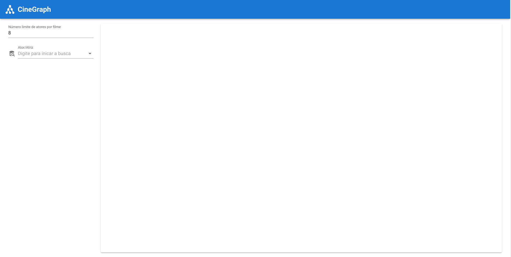
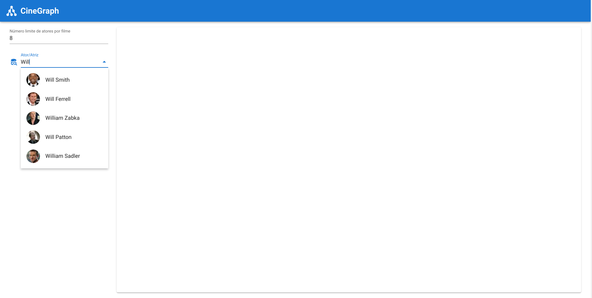
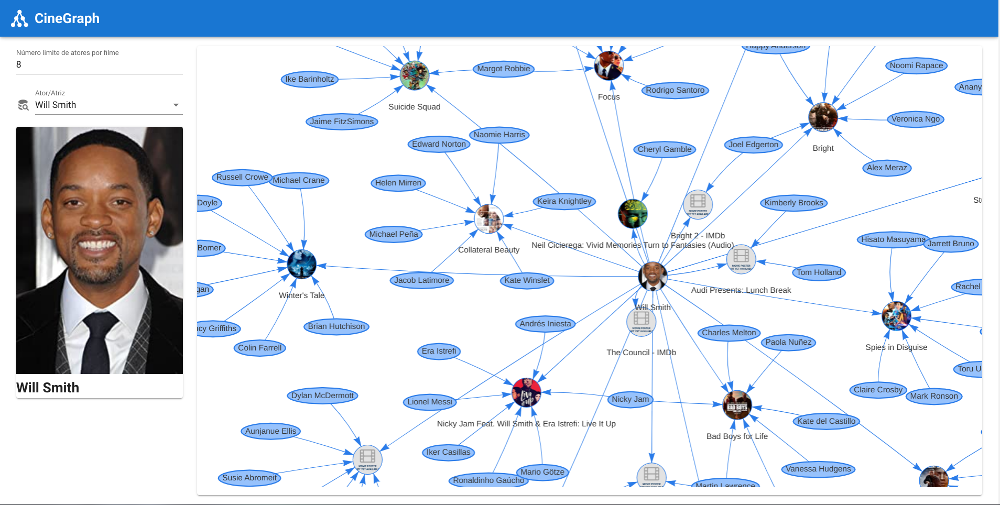
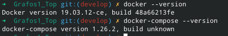
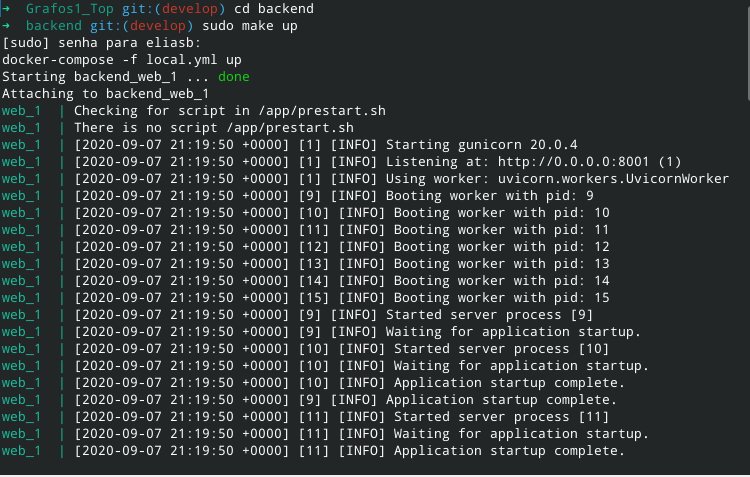
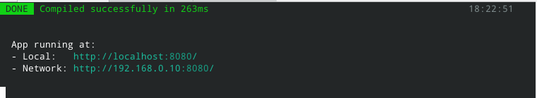

# CineGraph

**Número da Lista**: Não se aplica 
**Conteúdo da Disciplina**: Grafos 

## Alunos
|Matrícula | Aluno |
| -- | -- |
| 15/0009011 |  Elias Bernardo |
| 17/0141161  |  Erick Giffoni |

## Sobre 
Esse projeto tem como objetivo mostrar os relacionamentos 
entre atores/atrizes de cinema e os filmes em que eles 
participaram, utilizando o conceito de grafos.

O usuário interage com o software por meio de um navegador 
web da preferência dele. Existe uma barra de pesquisa na qual 
é possível buscar por um nome de uma atriz ou de um ator. 

Ao selecionar um ator ou atriz e fazer a busca, nosso projeto 
colhe informações tais como: nome e foto do ator ou da atriz; 
filmes que ele ou ela participou; outros atores ou atrizes que 
fizeram parte do elenco desses filmes etc.

A partir disso, mostra-se um grafo interativo na tela para que o 
usuário possa visualizar: 
1 - Os 15 filmes mais recentes que o ator/a atriz pesquisada(o) participou; 
2 - que outros atores/atrizes participaram desses filmes etc. 

**Backend**: 
    - Linguagem: Python 
    - Framework: [FastAPI](https://fastapi.tiangolo.com/) 
    - Bibliotecas: [ImdbPy](https://imdbpy.github.io/) 

**Frontend**: 
    - Linguagem: Javascript 
    - Framework: [VueJs](https://vuejs.org/) 

### Grafos & escolha do tema

O tema escolhido (filmes e atores/atrizes) foi escolhido por se encaixar adequadamente ao conceito de grafos: A partir de um ator podemos encontrar quais os filmes em que ele trabalhou, e a partir dos filmes encontrar outros atores que atuaram nesses filmes, resultando numa estrutura de grafo direcionado e bipartido. As arestas significam que determinado ator (from)participou de determinado filme (to), sendo que cada nó é um ator/atriz ou um filme.

## Screenshots

__Tela inicial__

__Tela de pesquisa__

__Tela de resultados exibindo o grafo montado__

## Instalação 

### Requisitos para utilizar esse projeto

- conexão de internet; 
- navegador web de escolha livre; 
- terminal/console/shell no computador; 
- npm; 
- docker & docker-compose; 
- clonar o projeto;

> Para clonar o projeto digite:

    git clone https://github.com/projeto-de-algoritmos/Grafos1_Top.git

### Instalando o backend

Tenha a certeza de ter o [docker](https://docs.docker.com/get-docker/) e o [docker compose](https://docs.docker.com/compose/) instalados e em execução. Você pode verificar a instalação de ambos com os seguintes comandos:

    docker --version

E 

    docker-compose --version

Caso ambos estejam corretamente instalados você deve obter uma saída parecida com:

> Note que a sua versão pode ser diferente da exibida abaixo.

Na sequência, considerando que você está na raiz do projeto, digite

    cd backend/

Para ir até a pasta do backend, e na sequência inicie a API com o comando

    (sudo) make up

> O sudo é opcional a depender de como você configurou o docker.

Caso nenhum erro ocorra você terá uma tela parecida com a abaixo:

### Instalando o frontend

Para o front é necessário ter instalado o [node & npm](https://nodejs.org/en/).

Caso você esteja na raiz do projeto vá até a pasta do front-end digitando num terminal:

    cd frontend

E instale as dependências necessárias com o comando:

    npm install

Após a instalação das dependências inicie o projeto:

    npm run serve

Caso tudo ocorra com sucesso você terá uma tela parecida com a abaixo:

## Uso

Antes de usar, faça a [instalação](#Instalação) do projeto.

1. Abra o navegador web de sua escolha; 
2. Digite na barra de busca o endereço informado pelo frontend (por padrão `http://localhost:8080/` caso você não tenha nenhuma outra aplicação utilizando essa porta);
3. (Opcional) Escolha o limite de atores que devem ser retornados por filme (8 por padrão);
4. Na barra de pesquisa da página, digite o nome de um ator ou de uma atriz; 
5. Selecione uma (1) das opções mostradas e clique nela 
6. Aguarde alguns segundos, o software está preparando o grafo 
(isso pode demorar um pouco) 
6.1 Essa parte porde demorar mais do que um minuto pelo fato de a aplicação fazr webscrapping em diversas páginas do Imdb então seja paciente!
7. Interaja livremente com o grafo ! 

- Para mover o grafo simplesmente segure e arraste em qualquer direção dentro do espaço em que se encontra o grafo após o mesmo ser carregado.

- É possível dar zoom no grafo: simplesmente use o scroll do mouse na parte interna do espaço em que se encontra o grafo.

- Caso queira ver mais detalhes sobre um filme simplesmente clique no nó correspondente. Uma tela com detalhes irá aparecer à esquerda.

## Problemas ? Sugestões ?

Caso você tenha alguma dificuldade, sugestão ou algum problema com o projeto, 
por favor entre em contato conosco:

- Elias Bernardo - ebmm01@gmail.com - telegram @ebmm01
- Erick Giffoni - giffoni.erick@gmail.com - telegram @ErickGiffoni 

